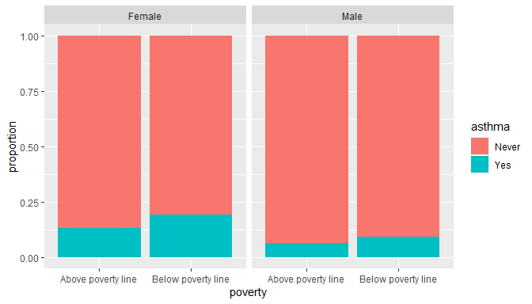

<!-- Title page -->
<!-- Abstract -->
Asthma is a chronic inflammatory disease of the lung airways. The
morbidity and severity of asthma varies substantially across genders,
ethnicities, socioeconomic backgrounds, and geographical locations. This
study investigates the differences in the effects of socio-demographic
factors on asthma prevalence in male and female gender groups. Using
unweighted 5-cycle (10-year) samples of NHANES between 2009 and 2018,
logistic regression and random forest models are fitted for the overall
population and subpopulations by gender to identify the most significant
factors and quantify the effects. The primary analysis results suggest
that gender is one of the most significant predictors of asthma
prevalence (49.11% increase in risk for women,
$CI_{95}=[44.07\%, 53.70\%]$). Between gender groups, obesity affects
male asthma prevalence stronger than female asthma prevalence (4.8 times
increase versus 2.2 times increase). *Non-Hispanic Black* men are 80%
more likely to suffer from asthma compared to *Non-Hispanic Black* women
($CI_{95}=[52.69\%,119.35\%]$). The risk of asthma in women with no high
school education is 20% higher compared to men
($CI_{95}=[19.37\%,21.05\%]$). The effects of smoking on asthma
prevalence are consistent between genders with only weak evidence for
the significance of smoking in either group. Poverty effects are
stronger among male respondents. The results emphasise the importance of
obesity, poverty, and ethnicity as factors contributing to asthma
prevalence.

<!-- TOC -->
# List of tables

<!-- removes default section name -->
# List of figures

<!-- Body -->
# 1 Introduction

Asthma is a serious health care concern worldwide, affecting millions of
people and incurring substantial social costs. The severity of the
asthma prevalence issue is due to a number of factors, including the
difficulty of diagnosis, incomplete understanding of the disease’s
mechanics and causes, and the varying short-term and long-term effects
across populations by geographic location and socio-demographic
conditions. This study contributes to a recent strand of literature that
focuses on socio-demographic determinants of asthma, exploring a 10-year
sample of the US population. It emphasises the interaction of gender
with other socio-demographic variables and explores both the inferential
and predictive power of statistical models.

The rest of this report is organised as follows. Section provides
further information on the study’s motivation and the underlying
theoretical framework. Section describes the data collection process and
justifies the methodological approach to modelling asthma prevalence in
different populations. Section describes in detail the main estimations
and results in the context of the theoretical framework and published
empirical literature. Section concludes with a discussion of the study’s
limitations and directions for future research.

# 2 Background

Asthma is a chronic inflammatory lung disease caused by a complex
combination of genetic and environmental factors (Chipps, 2004). It is
one of the most common non-communicable diseases and a major cause of
morbidity, disability, and quality of life deterioration, affecting more
than 300 million people worldwide (*The Global Asthma Report 2018*,
2018). Both the mechanisms underlying asthma and its causes are not
completely understood, with recent research suggesting that the disease
prevalence cannot be attributed to a single factor or a set of
non-interacting factors (Dharmage *et al.*, 2019). Although, in general,
the number of cases of asthma is expected to grow globally, there are
significant differences in asthma prevalence between countries and
geographic regions (To *et al.*, 2012).

Non-equitable access to health care due to race, ethnicity, and
socioeconomic disparities is often linked to higher levels of disease
prevalence, morbidity, and severity in disadvantaged communities. In the
US, the number of cases of the most common severe diseases, such as
cancer or diabetes, is disproportionately larger among the non-white
population (Williams *et al.*, 2016). Similar findings are reported for
respiratory diseases (Celedón *et al.*, 2014), emphasising higher
smoking incidence and rates of pollution as major contributors to
respiratory health inequities.

At the same time, one of the suggested factors of asthma prevalence is
urbanisation, which implies that wealth may be positively associated
with the number of asthma cases. This argument finds support in
empirical studies; in general, wealthier communities are expected to
have a higher prevalence of asthma while economically disadvantaged
regions tend to see more severe cases (Cruz *et al.*, 2010; Dharmage *et
al.*, 2019; To *et al.*, 2012). Controlling for urbanisation, the
evidence for higher risk of asthma dependent on socio-demographics
remains consistent (Williams *et al.*, 2009). Apart from health care
access, smoking, and pollution, other explanations for disparities based
on socio-economic factors include health literacy and education, stress
and mental health, and population clustering.

All asthma determinants discussed so far are modifiable and, thus,
empirical results obtained from investigating them can be used to
directly inform health care and socio-economic equity policies. However,
exploring the effects of non-modifiable risk factors is important as
well since, e.g., genetic factors may interact with non-modifiable
factors and alter the associated asthma outcomes (Chipps, 2004;
Martinez, 2006). Another non-modifiable factor that significantly
affects asthma prevalence and severity is gender – women, especially
younger women, are more likely to develop asthma symptoms, and the
symptoms tend to be more pronounced (Pignataro *et al.*, 2017).
Investigating the direct effects of non-modifiable risk factors and
their interactions with modifiable factors provides relevant evidence
for understanding the population differences in asthma prevalence and
designing personalised intervention policies (Greenblatt *et al.*, 2017;
Williams *et al.*, 2016).

The National Health and Nutrition Examination Survey (NHANES) is a
repeated survey with a complex design conducted continuously, every two
years, in the US. NHANES data contains a wide variety of measurements,
including health status, demographics, living conditions, dietary
conditions, etc. The data are widely employed in health care studies and
educational contexts due to ease of access and consistency across time.
This study is inspired by the investigation in Greenblatt *et al.*
(2017), which observes a sample of 3 cycles of NHANES and explores
socio-demographic determinants of asthma prevalence by gender.
Greenblatt *et al.* (2017) report large and statistically significant
differences in the adverse effects of *obesity* and *smoking* between
genders. This study seeks to validate and extend the investigation in
Greenblatt *et al.* (2017) by employing a larger sample of NHANES data
and exploring improvements to the original methodology.

# 3 Data and Methods

## 3.1 Data

This study combines 5 cycles (10 years) of NHANES data from 2009 to 2018
into a single sample. The dependent variable is the current diagnosis of
asthma, coded from two responses from the NHANES questionnaire: *“Has a
doctor or other health professional ever told you that you have
asthma?”* and *“Do you still have asthma?*”. The respondents who
answered “yes” to both questions are classified as having asthma; the
respondents who answered “no” to the first question are classified as
not having asthma. The sample also includes respondents’ gender, age,
ethnicity, education, BMI, smoking status, and poverty indicator.

Following Greenblatt *et al.* (2017), the poverty indicator is recoded
into a binary variable that takes value 1 if the respondent household
income is below the poverty line and value 0 otherwise. Likewise, the
education variable is recoded with three levels – below high school
education, high school education, and above high school education. The
*ethnicity* variable is transformed to combine *Mexican* and *Other
Hispanic* respondents. Respondents of age below 22 are excluded from the
sample to avoid bias in education responses. *I don’t know* and *Refused
to answer* responses to any of the survey questions are considered
missing observations. Across all variables, for respondents of age 22
and above, the number of these responses is 142 ($N = 27,889$). Apart
from *I don’t know* and *Refused to answer* responses, there is a large
number of *Not available* responses in the sample: 15,650 (56.12%),
2,906 (10.42%), and 1,467 (5.26%) for *smoke*, *poverty*, and *bmi*
variables, respectively. Overall, 17,336 (62.16%) of respondents are
excluded from the final sample; the sample size is $N = 10,553$. Since
the number of excluded observations is rather large, section contains a
discussion concerned with the validity of the primary sample. Table in
Appendix reports NHANES variables employed in the study with
descriptions.

## 3.2 Primary Analysis

For the primary analysis, the combined sample is considered a sample of
independent observations that is *not representative* of the US
population. Since the observations are independent, we can treat the
sample as a cross-sectional survey at a single time point and conduct
the analyses accordingly (Firebaugh, 1997). A problem with this
approach, of course, is that it assumes that the relationship between
predictors and the asthma outcome is constant across time. To mitigate
that, the sample includes a year dummy and the stability of observed
indicators is investigated before and during modelling.

The binary dependent variable implies a classification problem. The
response classes are highly unbalanced with only about 10.25% of the
respondents having asthma. Imbalanced classification is a difficult and
unsolved problem in various applications of statistics and especially in
health care studies (He and Garcia, 2009). The main problem the
imbalance response presents is that any naive statistical model will be
biased towards the majority class. Branco *et al.* (2016) provide an
extensive review of the approaches to mitigate the bias resulting from
imbalance. This study combines the measurement approach and the
resampling approach. With the former, models are optimised for a metric
other than accuracy – since accuracy can be very high and, at the same
time, not meaningful if the model predicts that all observations belong
to the majority class. This study uses ROC as the optimisation metric.
Another metric commonly employed in imbalanced classification is Cohen’s
Kappa (McHugh, 2012). The choice of ROC is justified by easier
interpretation and estimation of the metric. An additional justification
is, arguably, better control of the trade-off between specificity and
sensitivity. As much as it is important to correctly classify
individuals suffering from asthma, it is also important to maintain a
reasonable false positive rate since false positives may result in
economic losses due to misuse of health care resources.

The study employs logistic regression and random forest for
classification, with standardised continuous predictors and one-hot
encoding for categorical predictors. A baseline logistic model is
estimated with a raw sample and compared with upsampled regression and
random forest models. The study employs Random Over-Sampling Examples
(ROSE) (Lunardon *et al.*, 2014), which produces additional observations
in the minority class by synthetic generation based on the nearest
neighbours approach. The ROSE procedure is available as the *ROSE* R
package. Cross-validation for resampling and model fitting is performed
using the *caret* package. While it is possible to employ other
imbalanced classification techniques, this study focuses on the most
well-known. The body of literature exploring imbalanced classification
is massive (Branco *et al.*, 2016) and trying out all techniques
deserves a separate study.

# 4 Analysis

## 4.1 Exploratory Analysis

Table shows the frequencies for all variables in the primary sample by
gender. For comparison, Table in Appendix presents the same (unweighted)
statistics for the full sample. As we can see, the differences between
samples are substantial – the primary analysis sample, for instance, is
skewed towards male respondents. The fact that these differences emerge
even before applying survey weights emphasises the reason to treat the
primary analysis sample as non-representative of the population.

Female respondents are more likely to be suffering from asthma in both
samples, although, in the primary analysis sample, the difference is
much more pronounced (7.7 percentage difference in the primary sample vs
1.7 percentage difference in the full sample). The primary analysis
sample is, predictably, biased towards higher rates of smoking due to
the exclusion of *Not available* responses to the smoking question. The
average BMI is higher in both male and female respondents in the primary
analysis sample. In both samples, however, female respondents tend to
have a higher BMI with larger deviations from the mean. Tables and in
Appendix report asthma prevalence counts by year and gender. In the full
sample, gender differences are approximately consistent across time. In
the primary sample, we observe substantial fluctuations in the asthma
prevalence ratios by gender. The time-dependent differences between
samples are, most likely, caused by the exclusion of observations with
missing responses.

Table reports asthma prevalence counts across all variables. The same
information for the full sample is reported in Table in Appendix . As is
apparent from the Tables, this study ignores the absolute majority of
asthma cases among individuals younger than 22 years. Respondents in the
*Non-Hispanic Black* demographic group have the largest ratio of asthma
cases across ethnicities (13.07%), followed by *Non-Hispanic White*
(12.45%), *Other* (10.07%), and, lastly, *Hispanic* (8.12%). *ethnicity*
ratios in the primary analysis sample are consistent with the ratios in
the full sample with an overall skew towards higher asthma prevalence in
all groups.

Asthma prevalence in respondents with household income below the poverty
line is almost twice as high compared to wealthier households (16.15%
versus 9.93%). Almost half of the respondents suffering from asthma are
smokers; however, the differences in smoking prevalence between *Yes*
and *Never* groups are not as striking as the differences in income
(12.66% versus 10.43%). Similarly, asthma prevalence in respondents with
below high school (12.70%) and high school (11.33%) levels of education
is slightly higher than among respondents with *Above high school*
education (10.78%). Again, all of these observations generally hold in
the full sample, which provides justification for using the unweighted
subset of the population to explore the determinants of asthma
prevalence.

Figures and illustrate the difference in the effects of poverty and
smoking on asthma prevalence between genders. The figures highlight the
rationale for observing gender in studies of the determinants of asthma
prevalence – the adverse impact of low income appears to be amplified or
mitigated by the respondent’s gender. Here, the amplification of poverty
effects in female respondents appears to be linear. As Figures and
demonstrate, however, the interaction of gender with asthma determinants
may be more complicated. In Figure , we observe that female respondents
in the *Below high school* education group are more likely to suffer
from asthma compared to female respondents in the *High school* group.
Among male respondents, however, the interaction is reversed. In Figure
, we can see that female respondents identifying as the *Other*
ethnicity group have the highest asthma prevalence rate compared to
other groups – this observation does not hold for the male gender.

<div class="figure" style="text-align: center">



<p class="caption">

Poverty effects by gender

</p>

</div>

<div class="figure" style="text-align: center">


<p class="caption">

Smoking effects by gender

</p>

</div>

<div class="figure" style="text-align: center">


<p class="caption">

Education effects by gender

</p>

</div>

<div class="figure" style="text-align: center">


<p class="caption">

Ethnicity effects by gender

</p>

</div>

Figure shows the distribution of *bmi* in groups by gender and asthma.
Although the average body mass index among male respondents with and
without asthma is approximately the same, the distribution of *bmi* in
the asthma group is skewed towards a lower BMI. Female respondent BMI
values are more dispersed in general, with the average BMI in the asthma
group being remarkably higher.

<div class="figure" style="text-align: center">


<p class="caption">

BMI distribution by gender and asthma

</p>

</div>

Figure reports the distribution of *age* among male and female
respondents by *asthma*. The Figure suggests that women with asthma tend
to be younger while men with asthma tend to be older. Notably, the mean
age of the no-asthma group is higher for men. This may be a result of
the gender imbalance introduced in the sample by excluding missing
observations.

<div class="figure" style="text-align: center">


<p class="caption">

BMI distribution by gender and asthma

</p>

</div>

Overall, the results of the exploratory analysis support the validity of
the primary analysis sample. The results, further, suggest that all
socio-demographic variables in the sample affect asthma prevalence, with
direction and magnitude of effects varying in male and female groups.

## 4.2 Primary Analysis

Table reports the coefficients estimated in the baseline logistic
regression model. The baseline model is fitted on a full sample with no
balancing. Year dummies are not included since asthma prevalence does
not appear to be dependent on time based on the results of the
exploratory analysis and a model fit with year dummies included (the raw
output and analysis of deviance for two models are reported in Appendix
). The AIC of the model in Table is 6655.

*age* is the only variable that is not statistically significant in the
baseline model. *gender* is statistically significant at the 99%
confidence level with the largest associated coefficient in terms of
magnitude. The coefficient implies that men are 49.52% less likely to
have asthma. Respondents in all ethnicity groups other than *Hispanic*
have from 52.77% to 63.86% higher risk of asthma. Household income below
the poverty line increases the risk of asthma by 46.95%. The coefficient
associated with *Above high school* education is statistically
significant at the 95% confidence level and suggests that higher
education may reduce asthma prevalence by 17.32%. *High school* level of
education, however, is not significant at the same confidence level.
*smoke* is significant at the 95% confidence level with an associated
increase in asthma prevalence of 16.72%. Finally, a unit increase in
BMI, based on the estimate, is associated with a 38.38% increase in the
risk of asthma, significant at the 95% confidence level.

To understand the potential interaction between gender and demographic
variables, following Greenblatt *et al.* (2017), I support the baseline
analysis with separate models in *Male* and *Female* groups. Tables and
in Appendix report the estimated coefficients. In the *Female* group,
the *BMI* differences appear to have a much more substantial
contribution to asthma prevalence (41.61% risk increase versus 31.15% in
the *Male* group). *education* does not appear to have a significant
effect on asthma prevalence among male respondents. In the *Female*
group, higher education at least at the high school level reduces the
risk of asthma by 24.42%, significant at the 95% confidence level. The
*Male* group, in contrast, has much larger *ethnicity* and *poverty*
effects. The coefficient associated with smoking is not statistically
significant in either group. *age* has a weak (12.77%) effect in the
*Male* group and no significant effects in the *Female* group.

Although the baseline model provides useful inferences, it is not
particularly accurate when it comes to predicting asthma prevalence
based on socio-demographic characteristics. As Figure illustrates, the
model struggles with identifying respondents who are likely to have
asthma ($AUC = 0.664$). Table reports the confusion matrix with a
probability threshold of 0.2. The true positive rate at this threshold
is only 17.84%. At the threshold of 0.5, the model predicts that only 3
of the respondents have asthma.

<div class="figure" style="text-align: center">


<p class="caption">

Baseline ROC curve

</p>

</div>

While the quality of predictions may be slightly improved by moving the
threshold further down, the main problem is, indeed, the unbalanced
response. Before comparing the results of the logistic regression fit
with a random forest fit, as discussed in , this study explores whether
the model accuracy can be improved by employing the ROSE upsampling
(Lunardon *et al.*, 2014). Predictions produced by a ROSE logistic
regression model with 10-fold cross-validation and optimisation by ROC
are presented in Table . As is apparent from the Table, the upsampled
model is aggressively biased towards correctly identifying respondents
with asthma – at the 0.5 threshold, the true positive rate in the
testing sample is 60%. The precision of the model in the testing sample,
however, is 16.95% showing that the improvement in accuracy came at a
cost of a high false positive rate. The trade-off is visualised in . The
AUC of the model is 0.63.

<div class="figure" style="text-align: center">


<p class="caption">

ROSE ROC curve

</p>

</div>

Whether this trade-off is desirable in the context of health care is
difficult to determine. On one hand, identifying as many asthma cases as
possible is preferable. On the other hand, incorrect diagnoses incur
social costs. In any case, the ROSE logistic regression fitted in this
study is inappropriate for two reasons. First, the increase in
sensitivity is rather small compared to the drastic reduction in
specificity. Second, as the raw output of the ROSE model in Appendix
shows, higher accuracy is achieved by simply ignoring the effects of
predictors and boosting the base probability of asthma – the intercept
term.

The confusion matrix for a random forest model fitted on the raw sample
with 10-fold cross-validation is presented in Table . As we can see, the
random forest algorithm, likewise, struggles with the unbalanced
response – all respondents at the 0.5 threshold are classified as not
having asthma. Interestingly, as shown in Table , the fitted model
considers *age* an extremely important variable for determining asthma
prevalence.

The confusion matrix for a random forest model fitted on the ROSE
upsampled training sample with 10-fold cross-validation is presented in
Table . The model has a higher precision compared to the ROSE-upsampled
logistic regression model (24.47%) but does not reach the same true
positive rate – the rate in the random forest model is only 21.48%. More
importantly, however, as demonstrated in Table , the upsampled model
seems to correctly identify *gender*, *poverty*, and *ethnicity* as the
most important variables. This validates the baseline logistic
regression results and suggests that the model can be further tuned to
improve accuracy.

# 5 Conclusion

The study finds that *gender*, *poverty*, *ethnicity*, and *bmi* are the
most significant socio-demographic variables contributing to asthma
prevalence. *poverty* and *ethnicity*, contrary to the findings in
Greenblatt *et al.* (2017), are significant in both gender groups, with
a particularly strong impact on male respondents. *bmi*, conversely, has
stronger effects on the risk of asthma among female respondents. *age*
and *smoke* have weak but incosistent effects on asthma prevalence.
*Below high school* education appears to negatively affect asthma
prevalence rates in women. The effects of all socio-demographic factors
vary in gender groups and may be non-linear.

The difficulties with fitting a model with high true positive and low
false positive rates highlight the methodological issues that arise in
investigations of asthma determinants. As Dharmage *et al.* (2019)
emphasise, the complex nature of asthma and its causes pose a
significant challenge for asthma diagnoses and statistical
investigations based on diagnosis data. NHANES surveys have been an
extremely useful resource for asthma research in the US (Greenblatt *et
al.*, 2017; Han *et al.*, 2014); however, the complex design of the
surveys, the lack of laboratory analyses, and the relatively small
per-cycle sample sizes make statistical examinations of the NHANES data
a challenging task. This study makes several assumptions that are
difficult to validate empirically. In particular, it assumes that not
only the effects of potential asthma determinants but also the
socio-demographic variables that carry these effects are stable across
time. This assumption is rather strong and, indeed, some contradictions
between the results in this paper and the results in Greenblatt *et al.*
(2017) can potentially be attributed to the fact that this study used 5
NHANES survey cycles instead of 3.

Another methodological assumption made in this study is that the
unweighted and combined sample of NHANES data is valid for
investigations of asthma. Using this sample without considering survey
design essentially makes the research question of the study *“Are there
gender-specific socio-demographic determinants of asthma in general?”*
instead of *“Are there gender-specific socio-demographic determinants of
asthma in the US?”*. While the differences between primary and survey
samples have been explored in the study and found to be negligible, it
is recommended to not use the results for making population inferences
without further and more in-depth validation of the assumption. This is,
perhaps, the most severe limitation of the study, especially considering
that in-sample bias may make it difficult to validate the results using
another data source. Nonetheless, replicating and validating the results
of this study and Greenblatt *et al.* (2017) is a potential avenue for
future research.

A final limitation of this study is associated with the statistical
techniques employed. The analyses in , particularly the exploratory
analysis, illustrate vividly that the interactions between
socio-demographic determinants of health outcomes are complex and the
approaches to statistical modelling must be carefully considered.
Ultimately, this has led to the decision of observing the unweighted
NHANES sample in this study – with a view to apply more flexible
techniques. Another potential approach to untangling the asthma
determinant interaction complexity is specifying models that explicitly
address the interactions.

# References

<div id="refs" class="references csl-bib-body hanging-indent"
line-spacing="2">

<div id="ref-brancoSurveyPredictiveModeling2016" class="csl-entry">

Branco, P., Torgo, L. and Ribeiro, R.P. (2016), “[A Survey of Predictive
Modeling on Imbalanced Domains](https://doi.org/10.1145/2907070)”, *ACM
Computing Surveys*, Vol. 49 No. 2, pp. 1–50.

</div>

<div id="ref-celedonRespiratoryHealthEquality2014" class="csl-entry">

Celedón, J.C., Roman, J., Schraufnagel, D.E., Thomas, A. and Samet, J.
(2014), “[Respiratory Health Equality in the United States. The American
Thoracic Society
Perspective](https://doi.org/10.1513/AnnalsATS.201402-059PS)”, *Annals
of the American Thoracic Society*, Vol. 11 No. 4, pp. 473–479.

</div>

<div id="ref-chippsDeterminantsAsthmaIts2004" class="csl-entry">

Chipps, B.E. (2004), “[Determinants of asthma and its clinical
course](https://doi.org/10.1016/S1081-1206(10)61388-9)”, *Annals of
Allergy, Asthma & Immunology*, Vol. 93 No. 4, pp. 309–316.

</div>

<div id="ref-cruzSocialDeterminantsAsthma2010" class="csl-entry">

Cruz, A.A., Bateman, E.D. and Bousquet, J. (2010), “[The social
determinants of asthma](https://doi.org/10.1183/09031936.00070309)”,
*European Respiratory Journal*, Vol. 35 No. 2, pp. 239–242.

</div>

<div id="ref-dharmageEpidemiologyAsthmaChildren2019" class="csl-entry">

Dharmage, S.C., Perret, J.L. and Custovic, A. (2019), “[Epidemiology of
Asthma in Children and
Adults](https://doi.org/10.3389/fped.2019.00246)”, *Frontiers in
Pediatrics*, Vol. 7, p. 246.

</div>

<div id="ref-firebaughAnalyzingRepeatedSurveys1997" class="csl-entry">

Firebaugh, G. (1997), *Analyzing Repeated Surveys*, Sage Publications,
Thousand Oaks, Calif.

</div>

<div id="ref-greenblattGenderspecificDeterminantsAsthma2017"
class="csl-entry">

Greenblatt, R., Mansour, O., Zhao, E., Ross, M. and Himes, B.E. (2017),
“Gender-specific determinants of asthma among U.S. adults”, *Asthma
Research and Practice*, Vol. 3 No. 1, available
at:<https://doi.org/10.1186/s40733-017-0030-5>.

</div>

<div id="ref-hanAdiposityFractionalExhaled2014" class="csl-entry">

Han, Y.-Y., Forno, E. and Celedón, J.C. (2014), “[Adiposity, Fractional
Exhaled Nitric Oxide, and Asthma in U.S.
Children](https://doi.org/10.1164/rccm.201403-0565OC)”, *American
Journal of Respiratory and Critical Care Medicine*, Vol. 190 No. 1, pp.
32–39.

</div>

<div id="ref-heLearningImbalancedData2009" class="csl-entry">

He, H. and Garcia, E.A. (2009), “[Learning from Imbalanced
Data](https://doi.org/10.1109/TKDE.2008.239)”, *IEEE Transactions on
Knowledge and Data Engineering*, Vol. 21 No. 9, pp. 1263–1284.

</div>

<div id="ref-lunardonROSEPackageBinary2014" class="csl-entry">

Lunardon, N., Menardi, G. and Torelli, N. (2014), “ROSE: A Package for
Binary Imbalanced Learning”, *R J.*, available
at:<https://doi.org/10.32614/RJ-2014-008>.

</div>

<div id="ref-martinezGenesEnvironmentsDevelopment2006"
class="csl-entry">

Martinez, F.D. (2006), “[Genes, environments, development and asthma: A
reappraisal](https://doi.org/10.1183/09031936.00087906)”, *European
Respiratory Journal*, Vol. 29 No. 1, pp. 179–184.

</div>

<div id="ref-mchughInterraterReliabilityKappa2012" class="csl-entry">

McHugh, M.L. (2012), “[Interrater reliability: The kappa
statistic](https://doi.org/10.11613/BM.2012.031)”, *Biochemia Medica*,
pp. 276–282.

</div>

<div id="ref-pignataroAsthmaGenderFemale2017" class="csl-entry">

Pignataro, F.S., Bonini, M., Forgione, A., Melandri, S. and Usmani, O.S.
(2017), “[Asthma and gender: The female
lung](https://doi.org/10.1016/j.phrs.2017.02.017)”, *Pharmacological
Research*, Vol. 119, pp. 384–390.

</div>

<div id="ref-GlobalAsthmaReport2018" class="csl-entry">

*The Global Asthma Report 2018*. (2018), Global Asthma Network,
Auckland, New Zealand.

</div>

<div id="ref-toGlobalAsthmaPrevalence2012a" class="csl-entry">

To, T., Stanojevic, S., Moores, G., Gershon, A.S., Bateman, E.D., Cruz,
A.A. and Boulet, L.-P. (2012), “[Global asthma prevalence in adults:
Findings from the cross-sectional world health
survey](https://doi.org/10.1186/1471-2458-12-204)”, *BMC Public Health*,
Vol. 12 No. 1, p. 204.

</div>

<div id="ref-williamsSocialDeterminantsTaking2009" class="csl-entry">

Williams, D.R., Sternthal, M. and Wright, R.J. (2009), “[Social
Determinants: Taking the Social Context of Asthma
Seriously](https://doi.org/10.1542/peds.2008-2233H)”, *Pediatrics*, Vol.
123 No. Supplement 3, pp. S174–S184.

</div>

<div id="ref-williamsAchievingEquityEvolving2016" class="csl-entry">

Williams, J.S., Walker, R.J. and Egede, L.E. (2016), “[Achieving Equity
in an Evolving Healthcare System: Opportunities and
Challenges](https://doi.org/10.1016/j.amjms.2015.10.012)”, *The American
Journal of the Medical Sciences*, Vol. 351 No. 1, pp. 33–43.

</div>

</div>

# Appendix

## 5.1 Supporting Tables

## 5.2 Raw Model Output

``` r
## Baseline model with year dummies
df <- df.p %>% mutate_at(c("bmi", "age"),
                         ~(scale(.) %>% as.vector))

## Year as factor
df$year <- factor(df$year)

## One-hot encode nominal variables
x <- df %>% select(-c(asthma))
x <- dummyVars("~ .", x, fullRank = TRUE)
x <- data.frame(predict(x, newdata = df))

## Recode response as binary
y <- ifelse(df.p$asthma == "Yes", 1, 0)

## Baseline logit
baseline <- glm(y ~ ., cbind(x, y),
                family = "binomial")

summary(baseline)
```

    ## 
    ## Call:
    ## glm(formula = y ~ ., family = "binomial", data = cbind(x, y))
    ## 
    ## Coefficients:
    ##                              Estimate Std. Error z value Pr(>|z|)    
    ## (Intercept)                  -2.32737    0.12292 -18.933  < 2e-16 ***
    ## gender.Male                  -0.68357    0.06755 -10.119  < 2e-16 ***
    ## age                           0.02310    0.03652   0.633 0.526998    
    ## ethnicity.Non.Hispanic.Black  0.43248    0.10938   3.954 7.69e-05 ***
    ## ethnicity.Non.Hispanic.White  0.50222    0.09761   5.145 2.67e-07 ***
    ## ethnicity.Other               0.46917    0.14014   3.348 0.000814 ***
    ## poverty.Below.poverty.line    0.38660    0.07468   5.177 2.26e-07 ***
    ## education.High.school        -0.16077    0.09142  -1.759 0.078653 .  
    ## education.Above.high.school  -0.19609    0.08380  -2.340 0.019284 *  
    ## bmi                           0.32298    0.02893  11.164  < 2e-16 ***
    ## smoke.Yes                     0.15290    0.07340   2.083 0.037251 *  
    ## year.2011                    -0.07570    0.10434  -0.726 0.468105    
    ## year.2013                     0.04125    0.09847   0.419 0.675262    
    ## year.2015                     0.07457    0.10171   0.733 0.463484    
    ## year.2017                     0.04380    0.10341   0.424 0.671902    
    ## ---
    ## Signif. codes:  0 '***' 0.001 '**' 0.01 '*' 0.05 '.' 0.1 ' ' 1
    ## 
    ## (Dispersion parameter for binomial family taken to be 1)
    ## 
    ##     Null deviance: 6977.8  on 10552  degrees of freedom
    ## Residual deviance: 6625.5  on 10538  degrees of freedom
    ## AIC: 6655.5
    ## 
    ## Number of Fisher Scoring iterations: 5

``` r
## No year
x <- df %>% select(-c(asthma, year))
x <- dummyVars("~ .", x, fullRank = TRUE)
x <- data.frame(predict(x, newdata = df))

baseline.noy <- glm(y ~ ., cbind(x, y),
                    family = "binomial")

summary(baseline.noy)
```

    ## 
    ## Call:
    ## glm(formula = y ~ ., family = "binomial", data = cbind(x, y))
    ## 
    ## Coefficients:
    ##                              Estimate Std. Error z value Pr(>|z|)    
    ## (Intercept)                  -2.30882    0.11072 -20.853  < 2e-16 ***
    ## gender.Male                  -0.68365    0.06748 -10.131  < 2e-16 ***
    ## age                           0.02509    0.03648   0.688 0.491691    
    ## ethnicity.Non.Hispanic.Black  0.42376    0.10903   3.887 0.000102 ***
    ## ethnicity.Non.Hispanic.White  0.49388    0.09715   5.084 3.70e-07 ***
    ## ethnicity.Other               0.46680    0.13941   3.348 0.000813 ***
    ## poverty.Below.poverty.line    0.38491    0.07460   5.159 2.48e-07 ***
    ## education.High.school        -0.15337    0.09109  -1.684 0.092256 .  
    ## education.Above.high.school  -0.19029    0.08344  -2.281 0.022569 *  
    ## bmi                           0.32485    0.02885  11.258  < 2e-16 ***
    ## smoke.Yes                     0.15457    0.07339   2.106 0.035190 *  
    ## ---
    ## Signif. codes:  0 '***' 0.001 '**' 0.01 '*' 0.05 '.' 0.1 ' ' 1
    ## 
    ## (Dispersion parameter for binomial family taken to be 1)
    ## 
    ##     Null deviance: 6977.8  on 10552  degrees of freedom
    ## Residual deviance: 6627.8  on 10542  degrees of freedom
    ## AIC: 6649.8
    ## 
    ## Number of Fisher Scoring iterations: 5

``` r
## Year-noyear comparison
anova(baseline, baseline.noy)
```

    ## Analysis of Deviance Table
    ## 
    ## Model 1: y ~ gender.Male + age + ethnicity.Non.Hispanic.Black + ethnicity.Non.Hispanic.White + 
    ##     ethnicity.Other + poverty.Below.poverty.line + education.High.school + 
    ##     education.Above.high.school + bmi + smoke.Yes + year.2011 + 
    ##     year.2013 + year.2015 + year.2017
    ## Model 2: y ~ gender.Male + age + ethnicity.Non.Hispanic.Black + ethnicity.Non.Hispanic.White + 
    ##     ethnicity.Other + poverty.Below.poverty.line + education.High.school + 
    ##     education.Above.high.school + bmi + smoke.Yes
    ##   Resid. Df Resid. Dev Df Deviance
    ## 1     10538     6625.5            
    ## 2     10542     6627.8 -4  -2.3042

``` r
## ROSE resampling with cross-validation
summary(log.ROSE)
```

    ## 
    ## Call:
    ## NULL
    ## 
    ## Coefficients:
    ##                              Estimate Std. Error z value Pr(>|z|)    
    ## (Intercept)                   0.01638    0.06104   0.268 0.788395    
    ## gender.Male                  -0.55483    0.04219 -13.150  < 2e-16 ***
    ## age                           0.03149    0.02163   1.456 0.145462    
    ## ethnicity.Non.Hispanic.Black  0.12631    0.05711   2.212 0.026973 *  
    ## ethnicity.Non.Hispanic.White  0.18084    0.04837   3.739 0.000185 ***
    ## ethnicity.Other               0.14656    0.07354   1.993 0.046266 *  
    ## poverty.Below.poverty.line    0.35039    0.04657   7.524 5.29e-14 ***
    ## education.High.school        -0.05850    0.05264  -1.111 0.266419    
    ## education.Above.high.school  -0.15218    0.04711  -3.230 0.001238 ** 
    ## bmi                           0.24306    0.01931  12.584  < 2e-16 ***
    ## smoke.Yes                     0.16080    0.04377   3.674 0.000239 ***
    ## ---
    ## Signif. codes:  0 '***' 0.001 '**' 0.01 '*' 0.05 '.' 0.1 ' ' 1
    ## 
    ## (Dispersion parameter for binomial family taken to be 1)
    ## 
    ##     Null deviance: 10974  on 7915  degrees of freedom
    ## Residual deviance: 10464  on 7905  degrees of freedom
    ## AIC: 10486
    ## 
    ## Number of Fisher Scoring iterations: 4
